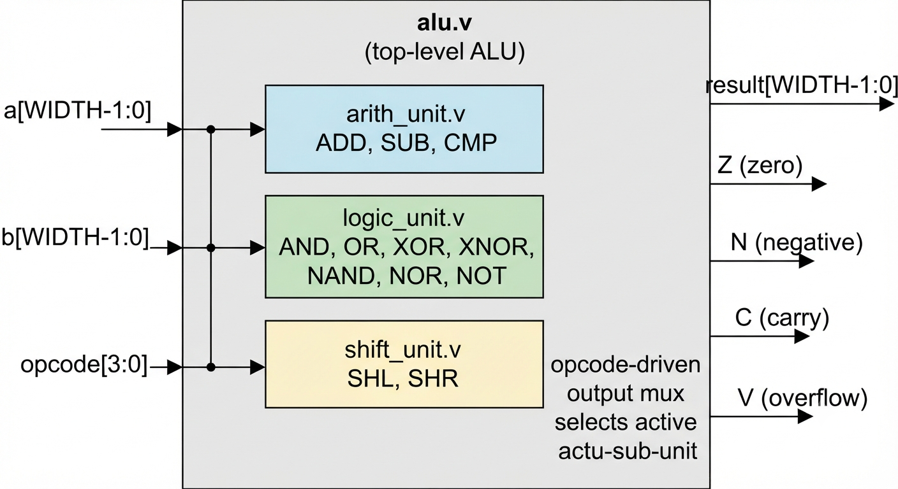
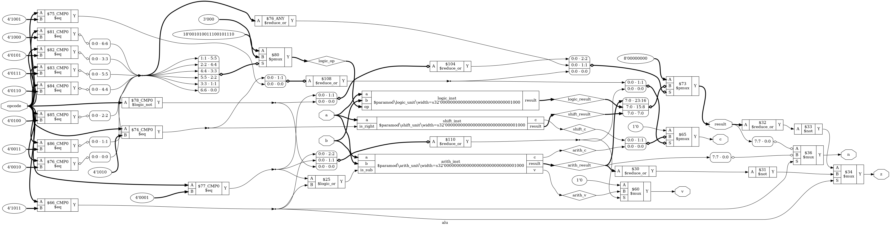

# Parameterized ALU — Verilog RTL Design & Synthesis

A synthesizable, parameterized N-bit Arithmetic Logic Unit built in Verilog-2001,
verified with a self-checking testbench, and synthesized through Yosys.

---

## Architecture



Each functional unit (`arith_unit`, `logic_unit`, `shift_unit`) is a standalone,
independently testable Verilog module. `alu.v` instantiates all three and
multiplexes the result based on the decoded opcode.

---

## Yosys Schematic



*(Insert the PNG generated via `dot -Tpng synth/alu_schematic.dot -o synth/alu_schematic.png`
into the repo and confirm this path renders before publishing.)*

---

## Module Interfaces

### `alu.v` (top-level)

| Port      | Direction | Width       | Description                          |
|-----------|-----------|-------------|---------------------------------------|
| `a`       | input     | `WIDTH`     | Operand A                             |
| `b`       | input     | `WIDTH`     | Operand B                             |
| `opcode`  | input     | 4           | Operation select (see opcode table)   |
| `result`  | output    | `WIDTH`     | ALU result                            |
| `zero`    | output    | 1           | Z flag — result == 0                  |
| `neg`     | output    | 1           | N flag — result MSB (signed negative) |
| `carry`   | output    | 1           | C flag — arithmetic carry/borrow out  |
| `overflow`| output    | 1           | V flag — signed arithmetic overflow   |

**Parameter:** `WIDTH` — default `8`, verified functional at `16`.

### `arith_unit.v`
Performs ADD, SUB, CMP. Produces carry/borrow and signed overflow directly
from the adder/subtractor datapath.

### `logic_unit.v`
Performs AND, OR, XOR, XNOR, NAND, NOR, NOT. Purely combinational, no flag
generation beyond Z/N (computed at the top level from the selected result).

### `shift_unit.v`
Performs SHL, SHR. Logical shifts, `WIDTH`-parameterized shift amount.

---

## Opcode Table

| Opcode | Operation | Opcode | Operation |
|--------|-----------|--------|-----------|
| `4'h0` | ADD       | `4'h6` | NAND      |
| `4'h1` | SUB       | `4'h7` | NOR       |
| `4'h2` | AND       | `4'h8` | NOT       |
| `4'h3` | OR        | `4'h9` | SHL       |
| `4'h4` | XOR       | `4'hA` | SHR       |
| `4'h5` | XNOR      | `4'hB` | CMP       |

---

## Flag Behavior

| Flag | Name     | Set when...                                              |
|------|----------|-----------------------------------------------------------|
| `Z`  | Zero     | `result == 0`                                              |
| `N`  | Negative | `result[WIDTH-1] == 1` (MSB, two's-complement sign bit)     |
| `C`  | Carry    | Unsigned carry-out on ADD, or borrow on SUB                |
| `V`  | Overflow | Signed overflow on ADD/SUB — result sign contradicts operand signs |

Flags are only meaningful for arithmetic operations (ADD, SUB, CMP); logic and
shift operations produce Z/N from their result but do not drive C/V.

---

## Synthesis Results — Yosys

Synthesized with Yosys 0.33, generic `synth -top alu` flow (no target-specific
technology mapping). Results below are the fully-flattened design totals from
the `stat` pass.

**Latch check:** `grep -i latch synth.log` reports **"No latch inferred"** for
every signal in every module (`alu.result`, `alu.c`, `alu.v`, `alu.logic_op`,
`logic_unit.result`, `shift_unit.result`, `shift_unit.c`). **Zero latches.**

**Check pass:** `Found and reported 0 problems.`

**Processes / memories:** 0 in every module — confirms fully combinational
design, no unintended state.

**Flattened cell count (design hierarchy total):**

| Cell type    | Count |
|--------------|-------|
| `$_ANDNOT_`  | 137   |
| `$_OR_`      | 73    |
| `$_AND_`     | 30    |
| `$_NOR_`     | 22    |
| `$_ORNOT_`   | 20    |
| `$_XOR_`     | 16    |
| `$_XNOR_`    | 17    |
| `$_MUX_`     | 10    |
| `$_NAND_`    | 10    |
| `$_NOT_`     | 6     |
| **Total**    | **341** |

Wires: 330 (443 wire bits) · Public wires: 31 (144 bits)

**Per-submodule breakdown (pre-flatten):**

| Module        | Cells | Notable |
|---------------|-------|---------|
| `arith_unit`  | 65    | ADD/SUB/CMP datapath, 1 `$_MUX_` |
| `logic_unit`  | 154   | 7-way bitwise op select, largest block |
| `shift_unit`  | 9     | Minimal — 7× `$_MUX_` for shift direction |
| `alu` (top)   | 116   | Includes opcode decode + output mux, before submodule inlining |

`logic_unit` is the largest block by cell count — expected, since it implements
7 distinct bitwise operations (AND/OR/XOR/XNOR/NAND/NOR/NOT) selected per-bit,
versus arithmetic's single adder/subtractor datapath and shift's simple mux chain.

---

## How to Simulate / Run Tests

```bash
# Compile
iverilog -o sim_alu tb/alu/tb_alu.v rtl/alu/alu.v rtl/alu/arith_unit.v \
    rtl/alu/logic_unit.v rtl/alu/shift_unit.v

# Run
vvp sim_alu

# View waveforms (if testbench dumps VCD)
gtkwave alu_tb.vcd
```

Expected: all self-checking assertions pass (currently 16/16 at `WIDTH=8`).

To re-run at 16-bit width, override the parameter at instantiation in the
testbench (`defparam` or module parameter override), recompile, and re-run.
All 16 test vectors must still pass — if any fail, the failure is almost
certainly a hardcoded width assumption (e.g. a literal `8'hFF` instead of
`{WIDTH{1'b1}}`) somewhere in the RTL. Find it and fix it before moving on.

---

## What This Demonstrates

- Parameterized, synthesizable RTL design (Verilog-2001) that scales cleanly
  across data widths without RTL changes.
- Modular hardware architecture: independently verifiable arithmetic, logic,
  and shift datapaths composed under a single top-level control/mux structure.
- Correct flag generation (Z/N/C/V) for arithmetic operations, matching
  standard ALU/CPU flag semantics.
- A self-checking testbench methodology (assertion-based, not manual waveform
  inspection) with full test coverage across all 12 opcodes.
- A complete RTL-to-gates flow: synthesis via Yosys, latch-free combinational
  logic (pending confirmed log), and netlist/schematic generation — i.e. not
  just simulation-only code, but design verified to actually synthesize.

---

## Next Steps

This project is intentionally scoped to end here. The natural next stage in
this learning path is pipelining (breaking this ALU into pipeline stages),
memory interfaces, and eventually composing these blocks into a simple CPU
datapath.
